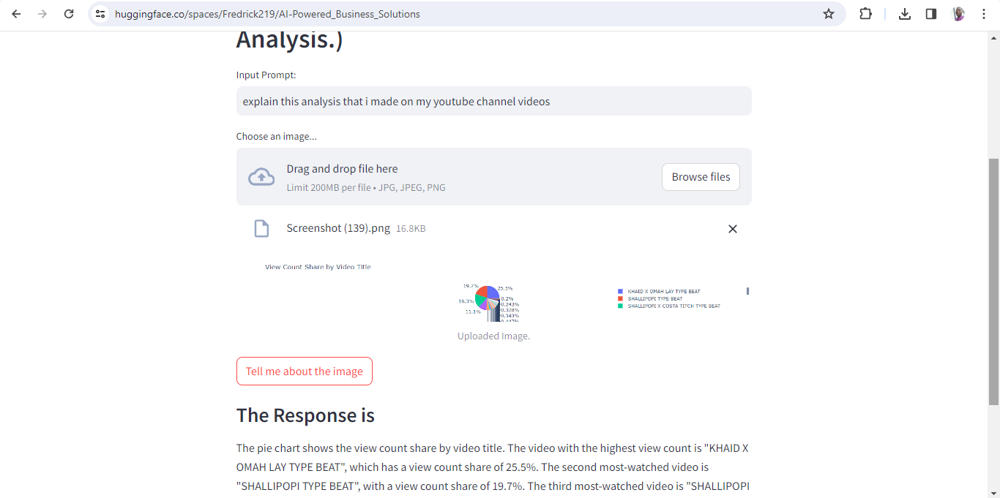

# AI-Powered Business Solutions


This project harnesses the power of artificial intelligence to provide innovative solutions across various business domains, including Customer Support Knowledge Base, Compliance and Regulatory Guidance, Market Research and Competitive Analysis, and Legal Document Analysis. By integrating advanced AI capabilities, the project aims to streamline operations, enhance efficiency, and deliver accurate insights in critical business functions.

## Features

- **Streamlit Web Application**: Utilizes Streamlit, a Python library for building interactive web applications, to provide a user-friendly interface for accessing AI-powered business solutions.
- **Google Generative AI Integration**: Integrates Google's Generative AI capabilities for generating content based on user input and uploaded images.
- **Flexible Input Prompt**: Users can input prompts related to their queries, enabling the AI system to analyze content and provide accurate assistance.
- **Image Analysis**: Supports image upload functionality to analyze visual content alongside textual prompts, enabling comprehensive business insights.

## Setup

1. **Clone the Repository**:
   ```bash
   git clone https://github.com/Fredrick219/ai-powered-business-solutions.git
   ```

2. **Install Dependencies**:
   ```bash
   pip install -r requirements.txt
   ```

3. **Set Up Environment Variables**:
   - Create a `.env` file in the project root directory.
   - Add your Google API key to the `.env` file:
     ```plaintext
     GOOGLE_API_KEY=your-google-api-key
     ```

4. **Run the Application**:
   ```bash
   streamlit run app.py
   ```

## Usage

1. Launch the Streamlit web application by running `streamlit run app.py`.
2. Input your prompt related to the desired business solution.
3. Optionally, upload an image related to the prompt for comprehensive analysis.
4. Click the "Tell me about the image" button to generate AI-powered responses.
5. View the generated response provided by the AI system.
6. You can also check out the app through the huggingface link provided in the repository.

## Contributing

Contributions to enhance the project are welcome! Feel free to submit issues for bug fixes, feature requests, or pull requests for improvements.

